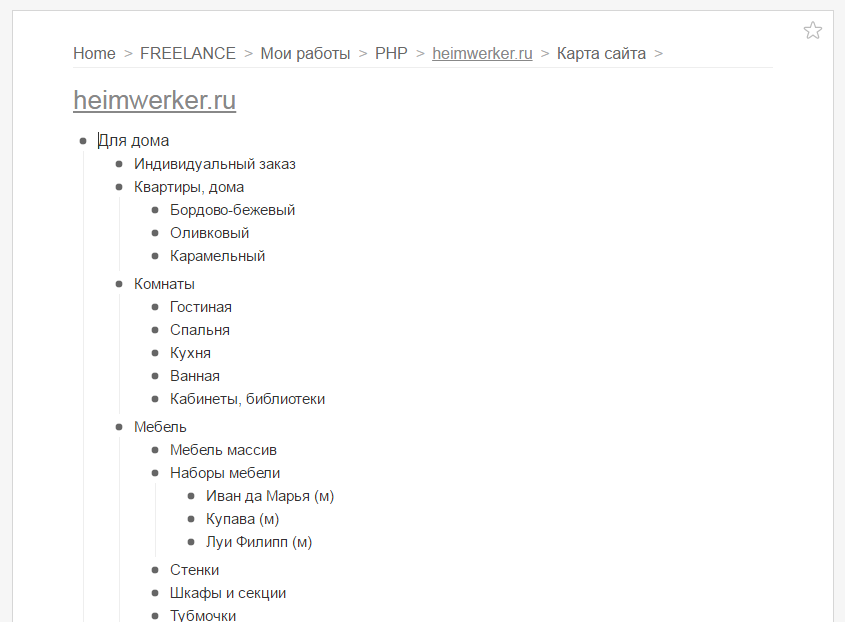
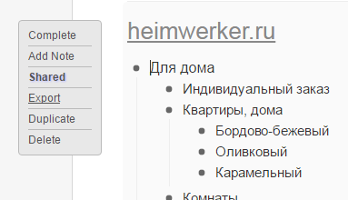
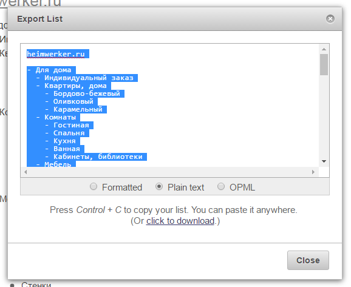

# QuickSSE
Quick Site Scaffold Engine (QuickSSE)  - по карте сайта генерирует сайт (иерархию папок и файлов), доступный для редактирования и наполнения контентом.

# Особенности/возможности
- Не использует БД, все данные хранятся в файлах.
- Возможно создание как динамического сайта (работающего на PHP), так и полностью статического.

Благодаря этому сайт работает предельно быстро и для его запуска подойдет самый дешевый или даже бесплатный хостинг. Также его можно использовать для создания "локального" сайта.

# Что доступно "из коробки"
- Генерация меню. Как адаптивного (для главного горизонтального меню), так и обычного (для вертикального меню);
- Генерация ссылок на дочерние разделы.
- Генерация галереи по имеющимся в папке картинкам.

# Алгоритм создания сайта

## Создание карты сайта
- На сайте [workflowy.com](https://workflowy.com/invite/d284f06.emlx) создаем древовидную карту сайта. Примерно как [тут](https://workflowy.com/s/6wulLKbE16).



- Экспортируем её в текстовый документ `sitemap.txt` (кодировке UTF-8).
  - Поднести курсов к корневому элементу
  - В появившемся меню выбрать пунтк "Export"

  

  - В появившемся диалоговом окне выбрать "Plain Text"

  

## Создание структуры папок по карте сайта
Выполните в консоли команду:
```
php quicksse makedirs sitemap.txt public
```

После её выполнения в папке `public` будет создана иерархия папок и файлов соответствующая карте сайта в файле `sitemap.txt`.

## Редактирование (шаблонов и блоков) и наполнение контентом (текстами и картинками)
После выполнения команды в предыдущем пункте для каждой строки в файле с картой сайта создается одноименная папка и одноименным файлом внутри, имеющим расширение `.page.html`. Эти файлы исползуются для показа контента.

Имя файла значения не имеет, и создается равным названию папки в которой он расположен, для удобства редактирования (чтобы были разные названия в окнах редактора). При наличии в папке нескольких файлов с расширением `.page.html`, будет использоваться первый найденный файл(//TODO: или может надо падать с ошибкой в этом случае, чтобы не допускать несольких файлов с таким расширением?).


# Структура файлов и папок
Каждой странице соответствует:
- Папка
- Внутри папки файл с расширением `.page.html`. Содержит контент страницы (который будет вписан в шаблон сайта).
- Файлы с расширениями `.png`,`.jpg`,`.jpeg`,`.gif`. Используются для показа галереи на сайте.
- Папка `thumbs` - содержит миниматюры картинок, показываемые на сайте. Может быть сгенерирована автоматически коммандой

# Комманды QuickSSE
## `make-dirs [sitemap] [directory]`
Создает структуру папок по заданному текстовому файлу с картой сайта.
`sitemap` - имя файла с картой сайта. По умолчанию `sitemap.txt`;
`directory` - папка которая является корнем сайта (в которой будут создаваться подпапки в соответствии с картой сайта `sitemap`).

## `make-sitemap [sitemap] [directory]`
Создает текстовый файл `sitemap` (в кодировке UTF-8) с картой сайта по иерархии папок в папке `directory`.
`sitemap` - имя файла с создаваемой картой сайта. По умолчанию `sitemap.txt`;
`directory` - папка которая является корнем сайта (в которой будут создаваться подпапки в соответствии с картой сайта `sitemap`).

## `make-thumbnails [source-directory] [options] [thumb-directory]`
Создает подпапки `thumbs` с уменьшенными картинками для галлерей на страницах сайта.
`source-directory` - папка в которой ищутся картинки и создаются подпапки с "превьюшками".
`options` - параметры "превьюшек". (//TODO: придумать как и что задавать. Например 800х400).
`thumb-directory` - имя подпапки с "превьюшками". По умолчанию `thumbs`.
